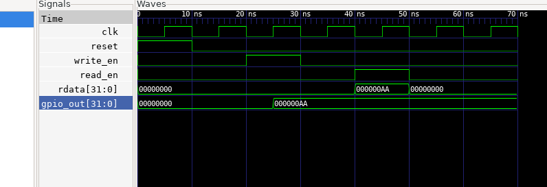

## Task-2: Simple GPIO Output IP

## Objective
Design a simple memory-mapped GPIO IP and simulate its functionality.
The IP allows software to write and read a 32-bit GPIO register.

---

## IP Specification

- IP Name: Simple GPIO Output IP
- Register Width: 32-bit
- Access Type: Read / Write

### Offset Map
| Address Offset | Register |
|---------------|----------|
| 0x00 | GPIO_DATA |

---

## Files

rtl/gpio_ip.v – RTL implementation  
tb/gpio_tb.v – Testbench  

---

## Simulation Tool
Icarus Verilog

---

## Simulation Commands

iverilog -o gpio_sim rtl/gpio_ip.v tb/gpio_tb.v  
vvp gpio_sim  

---

## Waveform Result

The waveform shows the following behavior:

- When `write_en` is asserted, the value from `wdata` is written into the GPIO register.
- The value appears on `gpio_out`.
- When `read_en` is asserted, the stored value is returned through `rdata`.
- When `reset` is asserted, the register clears to `0`.

---

## Functionality

- Writing to `GPIO_DATA` updates the GPIO output register.
- Reading `GPIO_DATA` returns the last written value.
- Reset clears the register to zero.

